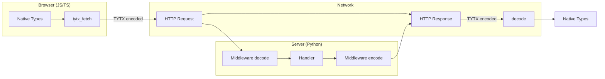
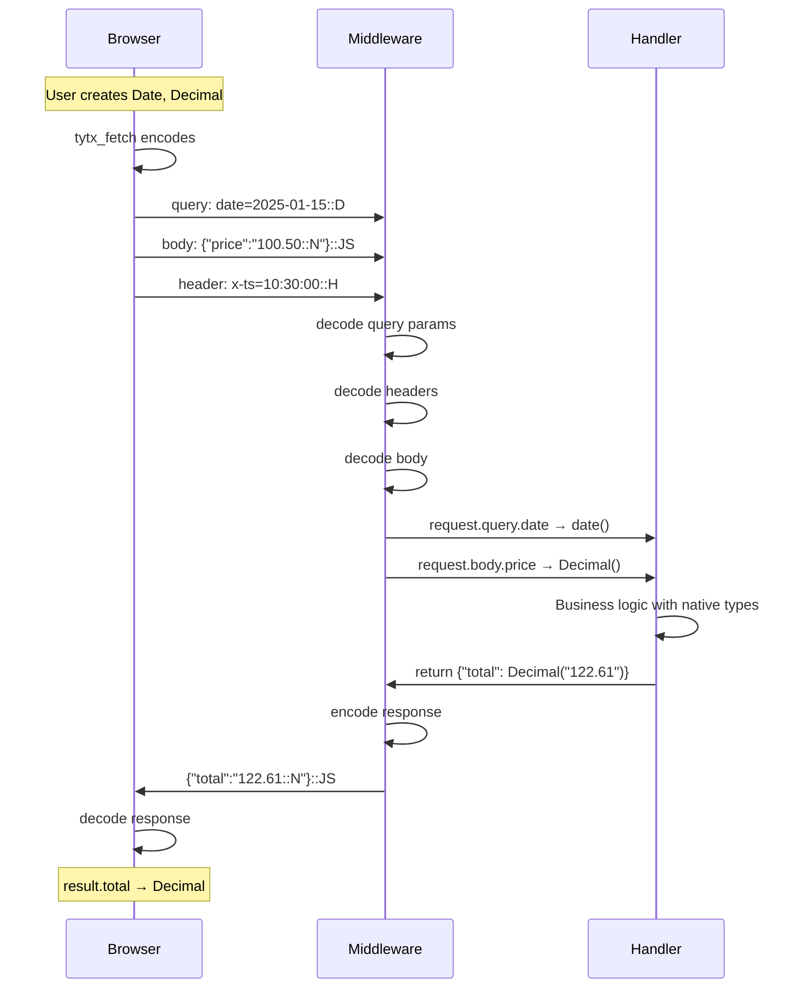
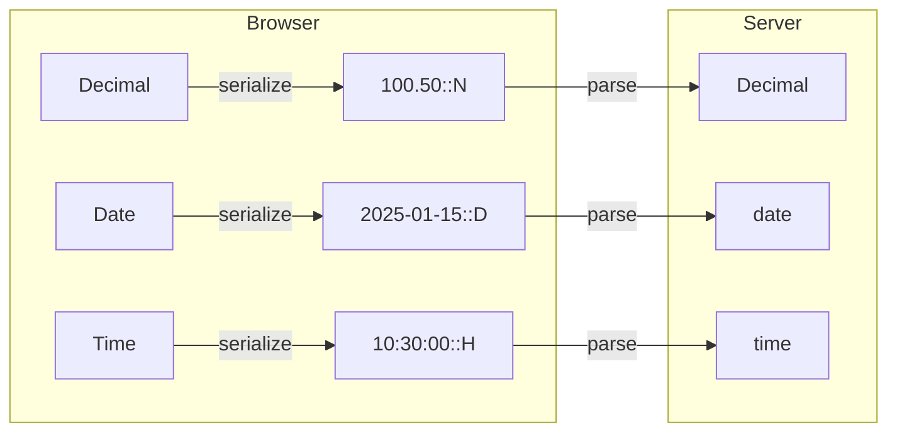
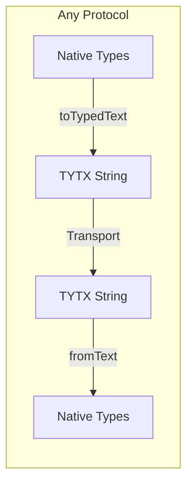

# TYTX HTTP Integration

Complete guide to transparent type handling across the HTTP stack.

## Overview

TYTX enables **transparent type handling** between browser and server. Application code works with native types - encoding/decoding happens automatically.



## Architecture

### Complete Flow



### Data Flow by Location

```mermaid
flowchart TB
    subgraph Request["Request Encoding"]
        Q[Query Params] -->|"date=2025-01-15::D"| QE[URL encoded]
        H[Headers] -->|"x-timestamp: 10:30:00::H"| HE[Header value]
        C[Cookies] -->|"session=abc::T"| CE[Cookie value]
        BD[Body] -->|'{"price":"100.50::N"}::JS'| BE[JSON body]
    end

    subgraph Response["Response Encoding"]
        RB[Response Body] -->|'{"total":"122.61::N"}::JS'| RE[JSON response]
        CT[Content-Type] -->|"application/vnd.tytx+json"| CTE[Header]
    end
```

## Browser Side (JavaScript/TypeScript)

### tytx_fetch API

```javascript
import { tytx_fetch } from 'genro-tytx';

const result = await tytx_fetch('/api/invoice', {
    // Query parameters - encoded in URL
    query: {
        date: new Date('2025-01-15'),      // → date=2025-01-15::D
        limit: 10                           // → limit=10 (native)
    },

    // Headers - typed values in header values
    headers: {
        'x-timestamp': createTime(10, 30),  // → x-timestamp: 10:30:00::H
        'x-request-id': 'abc123'            // → x-request-id: abc123
    },

    // Body - full TYTX encoding
    body: {
        price: new Decimal('100.50'),       // → "100.50::N"
        quantity: 5                          // → 5 (native)
    }
});

// Response automatically decoded
console.log(result.total);      // Decimal instance
console.log(result.created_at); // Date instance
```

### Helper Functions

```javascript
import { createDate, createTime, createDateTime } from 'genro-tytx';

// Create date-only (midnight UTC)
const date = createDate(2025, 1, 15);

// Create time-only (epoch date)
const time = createTime(10, 30, 0);

// Create datetime
const dt = createDateTime(2025, 1, 15, 10, 30, 0);
```

## Server Side (Python)

### ASGI Middleware

```python
from genro_tytx import from_text, to_typed_text, from_json, to_typed_json

class TYTXMiddleware:
    def __init__(self, app):
        self.app = app

    async def __call__(self, scope, receive, send):
        if scope["type"] != "http":
            await self.app(scope, receive, send)
            return

        # Decode request
        request = await self._decode_request(scope, receive)

        # Call handler
        response = await self.app(request)

        # Encode response
        await self._send_response(response, send)

    async def _decode_request(self, scope, receive):
        # Decode query string
        query = self._decode_query(scope.get("query_string", b""))

        # Decode headers
        headers = self._decode_headers(scope.get("headers", []))

        # Read and decode body
        body = await self._read_body(receive)
        content_type = self._get_content_type(headers)
        decoded_body = self._decode_body(body, content_type)

        return Request(query=query, headers=headers, body=decoded_body)

    def _decode_query(self, query_string):
        """Decode TYTX-encoded query parameters."""
        params = parse_qs(query_string.decode())
        result = {}
        for key, values in params.items():
            # Each value may have ::TYPE suffix
            result[key] = from_text(f'"{values[0]}"') if '::' in values[0] else values[0]
        return result

    def _decode_body(self, body, content_type):
        """Decode body based on content type."""
        if not body:
            return None
        if 'vnd.tytx+json' in content_type:
            return from_json(body.decode())
        if 'json' in content_type:
            return from_text(body.decode())
        return body
```

### WSGI Middleware

```python
class TYTXMiddleware:
    def __init__(self, app):
        self.app = app

    def __call__(self, environ, start_response):
        # Decode request
        request = self._decode_request(environ)

        # Call handler
        response = self.app(request)

        # Encode response
        return self._send_response(response, start_response)

    def _decode_request(self, environ):
        query = self._decode_query(environ.get('QUERY_STRING', ''))
        headers = self._decode_headers(environ)
        body = self._decode_body(environ)
        return Request(query=query, headers=headers, body=body)
```

### Framework Integration Examples

#### FastAPI

```python
from fastapi import FastAPI, Request
from genro_tytx import from_json, to_typed_json

app = FastAPI()

@app.middleware("http")
async def tytx_middleware(request: Request, call_next):
    # Middleware handles encoding/decoding
    response = await call_next(request)
    return response

@app.post("/invoice")
async def create_invoice(request: Request):
    # Body already decoded to native types
    data = request.state.tytx_body

    return {
        "total": data["price"] * Decimal("1.22"),
        "created_at": datetime.now(timezone.utc)
    }
```

#### Flask

```python
from flask import Flask, request, g
from genro_tytx import from_json, to_typed_json

app = Flask(__name__)

@app.before_request
def decode_tytx():
    if request.content_type and 'tytx' in request.content_type:
        g.tytx_body = from_json(request.get_data(as_text=True))

@app.after_request
def encode_tytx(response):
    if hasattr(g, 'tytx_response'):
        response.data = to_typed_json(g.tytx_response)
        response.content_type = 'application/vnd.tytx+json'
    return response
```

## Content Types

| Format | Content-Type | Example |
|--------|-------------|---------|
| TYTX JSON | `application/vnd.tytx+json` | `TYTX://{"price":"100::N"}::JS` |
| TYTX XML | `application/vnd.tytx+xml` | `<price>100::N</price>` |
| TYTX MessagePack | `application/vnd.tytx+msgpack` | Binary |

## Type Preservation



### Supported Conversions

| JavaScript | Wire Format | Python |
|------------|-------------|--------|
| `Decimal` (big.js) | `"100.50::N"` | `Decimal` |
| `Date` (midnight UTC) | `"2025-01-15::D"` | `date` |
| `Date` (with time) | `"2025-01-15T10:30:00.000Z::DHZ"` | `datetime` |
| `Date` (epoch date) | `"10:30:00::H"` | `time` |

## Error Handling

```python
from genro_tytx import TYTXDecodeError

try:
    data = from_json(request_body)
except TYTXDecodeError as e:
    # Invalid TYTX format
    return {"error": str(e)}, 400
```

## Best Practices

1. **Use middleware** - Don't decode/encode in handlers
2. **Set Content-Type** - Use `application/vnd.tytx+json` for TYTX responses
3. **Handle fallback** - Support plain JSON for non-TYTX clients
4. **Validate types** - Check decoded types match expectations
5. **Log wire format** - For debugging, log before decoding

## Other Protocols

TYTX is protocol-agnostic. The same encoding can be used with:

### WebSocket

```javascript
// Client
const ws = new WebSocket('wss://api.example.com');

ws.send(toTypedText({
    event: 'trade',
    price: new Decimal('100.50'),
    timestamp: new Date()
}));

ws.onmessage = (event) => {
    const data = fromText(event.data);
    // data.price → Decimal, data.timestamp → Date
};
```

```python
# Server (asyncio)
async def handler(websocket):
    async for message in websocket:
        data = from_text(message)  # Native types
        response = process(data)
        await websocket.send(to_typed_text(response))
```

### Server-Sent Events (SSE)

```python
async def sse_stream():
    while True:
        event = {
            "price": Decimal("100.50"),
            "updated_at": datetime.now(timezone.utc)
        }
        yield f"data: {to_typed_text(event)}\n\n"
```

### Message Queues (Redis, RabbitMQ, Kafka)

```python
# Producer
redis.publish('trades', to_typed_text({
    'price': Decimal('100.50'),
    'timestamp': datetime.now(timezone.utc)
}))

# Consumer
message = redis.subscribe('trades')
data = from_text(message)  # Native types
```

### gRPC / Protocol Buffers

Use TYTX for string fields that need type preservation:

```protobuf
message Invoice {
    string typed_data = 1;  // TYTX-encoded JSON
}
```

```python
invoice.typed_data = to_typed_text({
    'total': Decimal('122.61'),
    'due_date': date(2025, 2, 15)
})
```

### General Pattern



The pattern is always the same:

1. **Encode** native types to TYTX string
2. **Transport** via any text-capable protocol
3. **Decode** TYTX string back to native types
